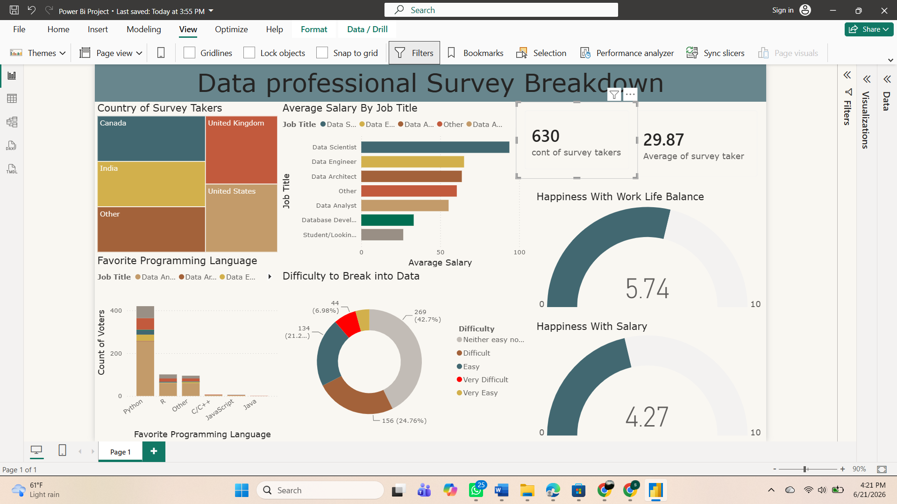

# Power BI Data Professional Survey Dashboard

## Project Overview

This project presents an interactive Power BI dashboard built using survey data collected from data professionals. The dashboard provides insights into salary trends, job roles, programming language preferences, work-life balance, and career satisfaction.

## Objectives

* Analyze survey responses from data professionals
* Identify salary trends across different job roles
* Explore popular programming languages used in the industry
* Evaluate work-life balance and job satisfaction metrics
* Present findings through an interactive dashboard

## Tools & Technologies

* Power BI
* Power Query
* Microsoft Excel
* Data Analytics
* Data Visualization

## Skills Demonstrated

* Data Cleaning
* Data Transformation
* Dashboard Development
* Business Intelligence
* Data Visualization
* Analytical Thinking

## Files Included

* Power Bi Project.pbix
* Power BI - Final Project.xlsx

## Key Insights

* Salary varies significantly across different data-related roles.
* Python remains one of the most popular programming languages among data professionals.
* Work-life balance and salary satisfaction differ across professions and regions.
* Interactive dashboards help transform survey data into actionable insights.

## Author

Sahel Ahmed Mohammad

Master of Science in Artificial Intelligence (Data Analytics)
Indiana Wesleyan University
## Dashboard Preview

